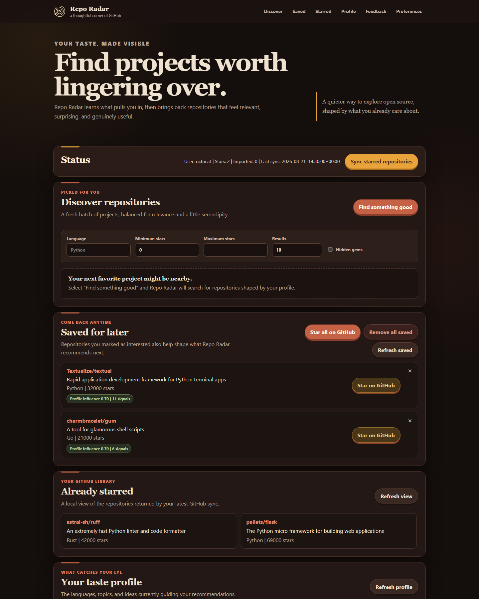

# Repo Radar

Repo Radar is a private, local-first GitHub discovery tool. It learns what kinds of software you care about from repositories you star, projects you save, your public GitHub portfolio, manual interests, and ongoing feedback. It then discovers repositories that match those interests, and discovers the open issues across GitHub that are the best contribution opportunities for you — including issues in repositories you have never seen — ranked with transparent relevance, activity, quality, and novelty signals.

[](https://github.com/quangshuynh/repo-radar/actions/workflows/ci.yml)

[](LICENSE)



## Features

- Discover repositories from focused GitHub searches
- Discover the best open contribution opportunities across GitHub, including repositories you have never saved or starred
- Optionally narrow contribution discovery to the repositories you already saved or starred
- Build one preference profile from several transparent sources
- Save interesting repositories for later
- Star one saved repository or a confirmed batch on GitHub
- Review the repositories in your synchronized GitHub star library
- Block or dismiss recommendations and undo that feedback later
- Exclude owned, archived, duplicate, saved, starred, blocked, and dismissed repositories
- Import public portfolio signals through GitProfileLens
- Use the local web interface or the complete command-line workflow
- Keep tokens, preferences, and repository history on your machine

Repo Radar never stars a repository without an explicit single-repository action or confirmed bulk action.

## Quick start

Repo Radar requires Python 3.11 or newer.

```bash
git clone https://github.com/quangshuynh/repo-radar.git
cd repo-radar
python -m venv .venv
```

Activate the virtual environment:

```powershell
# PowerShell
.venv\Scripts\Activate.ps1
```

```bash
# Git Bash, macOS, or Linux
source .venv/bin/activate
```

Install dependencies:

```bash
python -m pip install -r requirements.txt
```

Copy `.env.example` to `.env` and add a GitHub token:

```text
GITHUB_TOKEN=your_token_here
```

Start the local website:

```bash
python -m repo_radar web
```

Open `http://127.0.0.1:8000`.

## GitHub token setup

A classic personal access token with only the `public_repo` scope is recommended for public repository sync and starring.

Create one under GitHub Settings, Developer settings, Personal access tokens, Tokens (classic). Select:

- `public_repo` for public repositories
- `repo` instead only when private starred repository access is intentional

Fine-grained tokens may read starred repositories successfully while GitHub still rejects star mutations with a `403` response. Repo Radar supports either token format, but the classic `public_repo` token is the reliable option for the complete workflow.

Restart Repo Radar after changing `.env`. A running Python process keeps the token it loaded at startup.

Never commit `.env`, paste a token into logs or issues, or expose it through screenshots. Repo Radar never returns the configured token from its API.

## Preference sources

All sources feed the same normalized language, topic, and description-keyword profile.

| Source | Weight |
| --- | ---: |
| Starred repository | `1.00` |
| Pinned GitProfileLens repository | `0.80` |
| Saved interested repository | `0.70` |
| Manual seed preference | `0.60` |
| Other active GitProfileLens repository | `0.35` |
| Archived or forked imported repository | `0.00` |

Saved cards show their preference weight and signal count. Repositories with more usable language, topic, and description signals appear first in the Saved section.

## Web workflow

1. Add manual preferences or import a public GitProfileLens profile
2. Sync GitHub stars
3. Select **Find something good**
4. Save, dismiss, block, or star recommendations
5. Open **Contribute**, choose a scope, optionally narrow by **Issue type** and
   **Contributor-friendly only**, and select **Find an issue to work on**
6. Review saved repositories and the synchronized starred library
7. Open Feedback history to undo a previous classification

### Search

The Discover panel's **Search** box selects the language before ranking runs. Every search resolves to exactly one language:

1. Repo Radar looks for a programming language named in the query
2. If none is named — including an empty box — the language is Python
3. That language becomes a GitHub `language:` constraint, so results are repositories whose **top** language matches
4. The remaining words search topically
5. Your profile ranks the eligible candidates; it never selects the language

| Search | Effect |
| --- | --- |
| *(empty)* | Python repositories |
| `automation` | Python repositories about automation |
| `javascript` | JavaScript repositories |
| `typescript developer tools` | TypeScript repositories about developer tools |
| `go api` | Go repositories about APIs |

A language name is recognized anywhere in the query, except for short abbreviations and names that are also everyday words (`go`, `swift`, `shell`, `c`, `r`, `js`), which only count as a language when they lead the query. A repository never qualifies because a language is mentioned in its name, description, or topics.

Sync reconciles the local Saved list with GitHub. If you star a saved repository outside Repo Radar, the next sync removes it from Saved and records it as starred locally.

Clearing blocked or dismissed feedback makes that repository eligible for discovery again. Clearing interested feedback also removes the repository from Saved. Clearing a starred feedback record does not unstar it on GitHub or remove it from the synchronized starred cache.

## Command-line usage

```bash
python -m repo_radar init
python -m repo_radar import-profile your_username
python -m repo_radar sync
python -m repo_radar profile
python -m repo_radar recommend
python -m repo_radar recommend --limit 5
python -m repo_radar contribute
python -m repo_radar contribute --limit 5 --unassigned-only
python -m repo_radar contribute --scope saved-starred
python -m repo_radar contribute --label bug
python -m repo_radar contribute --label documentation --contributor-friendly
python -m repo_radar contribute --label bug --label accessibility --contributor-friendly
python -m repo_radar feedback owner/repository not-interested
python -m repo_radar web
```

- `init` replaces the current comma-separated language, topic, and keyword seeds
- `import-profile` imports the optional GitProfileLens public repository report
- `sync` refreshes the authenticated user's starred repository cache
- `profile` prints the merged preference profile and active source counts
- `recommend` discovers and ranks a fresh set of eligible repositories
- `contribute` discovers and ranks open contribution opportunities across GitHub; `--scope saved-starred` restricts it to repositories you saved or starred, and `--label` / `--contributor-friendly` narrow which issues are retrieved
- `feedback` records `interested`, `not-interested`, `starred`, or `blocked`
- `web` starts the local FastAPI interface on `127.0.0.1:8000`

## How recommendations work

Web searches build targeted queries within the selected language, combining the topical terms with your strongest profile topics. The `recommend` command instead builds them from the strongest profile languages and topics. Either way Repo Radar deduplicates the results, applies ownership and feedback exclusions, then ranks eligible repositories using:

- Preference relevance
- Repository activity
- Modest quality signals
- Result novelty

The ranking system uses weighted counts and readable heuristics rather than embeddings, language models, or opaque machine-learning models.

## Contribution discovery

The **Contribute** view answers a different question from Discover: not *which repositories
might interest me*, but *which open issues anywhere on GitHub are the best use of my time to
investigate*.

Repository discovery is part of contribution discovery. A repository does **not** need to be
saved, starred, previously recommended, or previously seen to produce a contribution
recommendation — if an unknown repository holds an unusually strong issue match for your
profile, Repo Radar can surface it.

### Two scopes

| Scope | Question it answers |
| --- | --- |
| **Discover best opportunities** (default) | What open-source issues are the best contribution opportunities for me, anywhere on GitHub? |
| **Saved & starred only** | What should I contribute to among the repositories I already saved or starred? |

Both scopes converge on the same normalized issue candidates and the same ranking
implementation. They differ only in where candidates come from.

### Filtering what gets retrieved

Two independent filters narrow either scope. Both are **retrieval** rules: they change which
issues are fetched and considered, never how a candidate scores or how it is explained.

**Issue type** — zero or more of `bug`, `documentation`, `enhancement`, `accessibility`.

- no categories selected means **any** category, which is the default behavior;
- one category requires that label;
- several categories mean **OR** — an issue needs any one of them, not all of them.

**Contributor-friendly only** — a separate toggle that requires one of `good first issue`,
`help wanted`, `contributions welcome`, or `up for grabs`. It is independent of issue type;
you can ask for either, both, or neither.

```bash
python -m repo_radar contribute --label bug
python -m repo_radar contribute --label documentation --contributor-friendly
python -m repo_radar contribute --label bug --label accessibility --contributor-friendly
```

The web interface offers the same controls as an **Issue type** dropdown, where any
combination of the four categories can be checked, and a separate **Contributor-friendly
only** checkbox. Both keep your selection between runs. Only the four
categories above are accepted; anything else fails at argument parsing (CLI) or with a `400`
(API).

Selecting `--label bug --label documentation --contributor-friendly` searches for

```text
label:"bug","documentation" label:"good first issue","help wanted","contributions welcome","up for grabs"
```

Comma-separated values inside one `label:` qualifier are an **OR**; separate `label:`
qualifiers are **ANDed**. So that query means *(bug OR documentation) AND (good first issue OR
help wanted OR contributions welcome OR up for grabs)*, and it costs the same single request
that an unfiltered search of the same repositories costs. **Selecting more labels never buys
more Search API requests** — filters are qualifiers on the queries described below, not extra
queries. They do share the 256-character query budget, so a heavily filtered grouped search
may cover fewer repositories per request rather than issuing another one.

Results stay personalized and ranked exactly as described under
[How ranking works](#how-ranking-works). A filter decides what is eligible; your profile
decides the order.

### How the default scope finds issues

```text
preference profile
    ↓  deterministic, bounded query generation
GitHub issue searches
    ↓  deduplication and ownership/feedback exclusions
issue candidates
    ↓  bounded repository hydration for the strongest candidates
issue + parent repository
    ↓
ranked contribution opportunities
```

Query generation is a pure function of your profile and your selected filters — signals are
sorted by weight then name, so the same inputs always produce the same searches. Two
deliberately different strategies run against each of your two strongest languages:

- a **relevance** search carrying your strongest topics and description keywords as free text,
  with **no invitation label qualifier**, so a highly relevant unassigned bug or testing issue
  is reachable without a `good first issue` label;
- an **invitation** search carrying `good first issue`, `help wanted`, `contributions welcome`,
  and `up for grabs`, with no profile terms, so a project you have never encountered can enter
  the pool on an explicit call for contributors.

Relevance searches are issued first, so a reduced budget always keeps the strategy that is not
restricted to beginner labels. Terms that merely restate a language the `language:` qualifier
already carries are dropped, because they narrow nothing and displace a term that would.

Selected issue-type categories are ANDed onto **both** strategies. Turning on
**Contributor-friendly only** additionally puts the invitation labels on the relevance search,
because leaving one query unrestricted would return exactly the issues you asked to exclude.
The two strategies stay distinct either way: one carries your profile terms, the other
deliberately carries none.

GitHub's issue search returns `repository_url` but no repository language, topics,
description, popularity, or activity — all of which the repository relevance signal needs. So
candidates are pre-ordered by their issue-only strength, and metadata is fetched for at most
the **twelve** strongest repositories. Issues whose repository was not hydrated are dropped.
That is the deliberate tradeoff: repository relevance stays a real signal for discovered
issues, without a request per candidate.

### How the saved and starred scope finds issues

1. Saved repositories first, then the synchronized starred cache.
2. Archived repositories, repositories you own, repositories owned by your imported
   GitProfileLens profile, and anything you blocked or dismissed are removed.
3. The remaining repositories are ordered by explicit interest, then by their repository
   relevance score, and the strongest ten become the search scope.
4. Those ten are batched five at a time into grouped `is:issue is:open` searches.

Pull requests, closed issues, archived repositories, and rows without a usable repository,
number, or title never enter the candidate set, in either scope.

### How ranking works

Issue ranking is a separate scoring layer from repository ranking, and it does not change any
repository ranking weight. Every recommendation is scored as:

| Signal | Weight | What it measures |
| --- | ---: | --- |
| Repository relevance | `0.30` | the existing repository score for the repository owning the issue |
| Issue relevance | `0.35` | profile overlap with the issue title, labels, and a bounded slice of the body |
| Contribution friendliness | `0.15` | beginner and help-wanted labels, no assignee, a written description |
| Freshness | `0.10` | recency of the last update, decaying to zero over 180 days |
| Scope readiness | `0.10` | reproduction steps, code references, discussion volume, caution labels |

Personalization carries `0.65` of the total, so a beginner label alone cannot lift an
unrelated issue above a strongly relevant one. Ties break on repository name, then issue
number, so ordering is fully deterministic. A separate per-repository cap of three keeps one
busy project from filling every slot; it is applied after scoring, so the score you see is
always raw relevance rather than a diversity-adjusted value.

Repository relevance and issue relevance stay conceptually distinct, in both directions. A
famous, highly relevant repository does not make an irrelevant issue inside it a strong
recommendation, and an unknown repository with a strongly matching issue and good
contribution signals can outrank a known one. **Having saved or starred a repository adds no
ranking credit of its own** — it changes which candidates are sourced in the narrower scope,
never how they score. Where a repository came from is reported on the card as `new to you`,
`from your saved list`, or `from your starred library`, and it is presentation metadata that
never appears in the "Why recommended" evidence.

Assigned issues are **kept with a reduced friendliness score rather than hidden**, because
GitHub assignment is frequently stale and silently discarding issues contradicts the
project's transparency goal. The assignment is stated in the explanation, and
`--unassigned-only` (or the **Unassigned only** checkbox) filters them out when you want that.

### Why it stays explainable

Every recommendation lists only the evidence that actually contributed to its score: the
repository match, the matched profile terms, the labels that scored, assignment status, and
update recency. The scope signal (`Focused`, `Unclear`, or `Needs discussion`) reports its own
evidence and is deliberately descriptive. Repo Radar does not estimate difficulty or effort,
and it uses no language model, embedding, or learned ranker.

### GitHub API behavior and limits

Issue search uses the GitHub Search API, which is limited to **30 authenticated requests per
minute** — far tighter than the 5000 per hour core limit. Every bound below is a named
constant in `repo_radar/contribution.py`, and tests assert them.

| Scope | Search API requests | Core API requests | Issue candidates |
| --- | ---: | ---: | ---: |
| `discover` | ≤ 4 (`MAX_DISCOVERY_QUERIES`) | 1 `/user` + ≤ 12 (`MAX_REPOSITORY_HYDRATIONS`) | ≤ 120 |
| `saved_starred` | ≤ 2 | 1 `/user` | ≤ 120 |

- The worst case for one discovery run is therefore **4 search requests and 13 core requests**.
  Repository hydration is core API traffic, not search traffic, so it never competes with the
  30 per minute search limit.
- Results are single page. There is no pagination and no per-candidate request fan-out.
- Queries use GitHub's current advanced issue search syntax and stay within the 256 character
  query limit and GitHub's cap on boolean operators per query. When a query would exceed the
  limit, its weakest terms are dropped until it fits.
- Profile terms are sanitized before they enter a query, so a stored preference cannot change
  the structure of the search it appears in.
- If a search fails or is rate limited, the run stops early, keeps whatever it already
  collected, and reports a warning instead of failing. Configured tokens are never echoed.
- A single repository lookup that fails for that repository alone (a rename or deletion) drops
  that candidate silently rather than aborting the run; a rate limit or credential failure
  stops hydration and reports a warning.

### Known limitations

- Discovery ranks a bounded pool. Only the twelve strongest repositories are hydrated, so an
  excellent issue in a thirteenth repository is not ranked.
- Recommendation quality is **not yet measured**. A frozen corpus of real issues exists and is
  awaiting human relevance judgments — see below.
- Repository-level contribution readiness (`CONTRIBUTING.md`, CI metadata, maintainer
  responsiveness) is **not** measured. It would require per-repository requests beyond the
  hydration budget.
- Issue results are generated on demand and are not cached.
- Labels are normalized against a small transparent vocabulary, so unusual project-specific
  labels contribute nothing rather than being guessed at.
- Contribution recommendations are read-only. Repo Radar never comments, assigns, or opens
  a pull request.

## Recommendation evaluation

Ranking quality is measured offline against a frozen repository corpus with explicit graded relevance labels:

```bash
python -m repo_radar.evaluation
```

The evaluation reports NDCG@10, Precision@10, Recall@10, MRR, a redundancy diagnostic, and popularity-bias diagnostics for several preference scenarios. It contacts no network service and reads no local `data/` state.

A second, independent evaluation hides some of the user's real starred repositories, rebuilds the preference profile from the rest, and measures whether the ranker recovers them from a pool of real GitHub distractors:

```bash
python -m repo_radar.heldout_evaluation
```

This reports Hit Rate@5/@10, Recall@10, MRR, and the held-out rank distribution, alongside popularity/activity/random baselines and evaluation-only language-weighting ablations. It reads a frozen snapshot in `evaluation/heldout/` and contacts no network service.

A GitHub star is a **behavioral proxy, not ground truth** — it may represent a bookmark, a dependency, or past curiosity as easily as current interest.

See [evaluation/README.md](evaluation/README.md) for both methodologies, label definitions, and limitations.

### Contribution ranking evaluation

Issue ranking is evaluated separately, against a frozen corpus of **real GitHub issues**
captured through both production scopes:

```bash
python -m repo_radar.contribution_evaluation
```

It reports NDCG@5 (primary), NDCG@10, Precision@5, MRR, and a repository diversity
diagnostic, per scope, entirely offline.

**The corpus is not yet judged, so no quality baseline exists.** The command currently reports
the ranking behavior and explicitly reports no metrics, and refuses to freeze a baseline.
Repo Radar does not claim its issue ranking is validated. Labelling it:

```bash
python -m repo_radar.contribution_evaluation --labeling-sheet
```

Then replace each `null` in `evaluation/contributions/judgments.json` with `0`–`3`. Judgments
are recorded by hand, are never derived from Repo Radar's own score, and must reflect only
what was knowable when the issue was recommended — not whether the fix later turned out to be
easy or whether a pull request was merged.

Refreshing the corpus is a separate, explicit command that contacts GitHub once and preserves
every judgment already recorded:

```bash
python -m repo_radar.contribution_snapshot
```

See [evaluation/contributions/README.md](evaluation/contributions/README.md) for the corpus
methodology, the label scale, and the limitations.

## Local data and privacy

Private application state is stored as JSON under `data/`:

- Starred repository cache
- Saved repositories
- GitProfileLens import data
- Manual seed preferences
- Derived profile scores
- Feedback history
- Sync status

The `data/` directory and `.env` are ignored by Git. The web server binds only to `127.0.0.1`. Data is sent only to GitHub and, when requested, GitProfileLens. Repo Radar has no telemetry, analytics, cloud database, background worker, or third-party recommendation service.

## Development

Run the complete validation suite:

```bash
python -m pytest
python -m ruff check .
python -m ruff format --check .
node --check repo_radar/static/app.js
```

Tests mock GitHub and GitProfileLens requests. They do not call either live service.

To inspect local coverage without enforcing an arbitrary threshold:

```bash
python -m pytest --cov=repo_radar --cov-report=term-missing
```

Contributions are welcome. Read [CONTRIBUTING.md](CONTRIBUTING.md) for setup and pull request guidance. Report security concerns according to [SECURITY.md](SECURITY.md), and never include a GitHub token in an issue or screenshot.

## Current boundaries

- Search coverage depends on the strongest profile signals and GitHub search limits
- Contribution discovery ranks a bounded candidate pool rather than all of GitHub
- Contribution ranking quality is unmeasured until the frozen issue corpus is labelled
- Recommendations are generated on demand rather than cached
- GitProfileLens remains optional and the last valid import survives refresh failures
- GitHub starring depends on token capabilities and GitHub API availability
- Repo Radar does not automatically unstar repositories

## Roadmap

- Label the frozen contribution corpus and freeze the first issue-ranking quality baseline
- Improve recommendation explanations with per-signal score details
- Add sorting and filtering to the starred library
- Add pagination for large saved and starred collections
- Add profile-source controls without creating a second profile format
- Package the application for simpler installation

## License

Repo Radar is available under the [MIT License](LICENSE).
